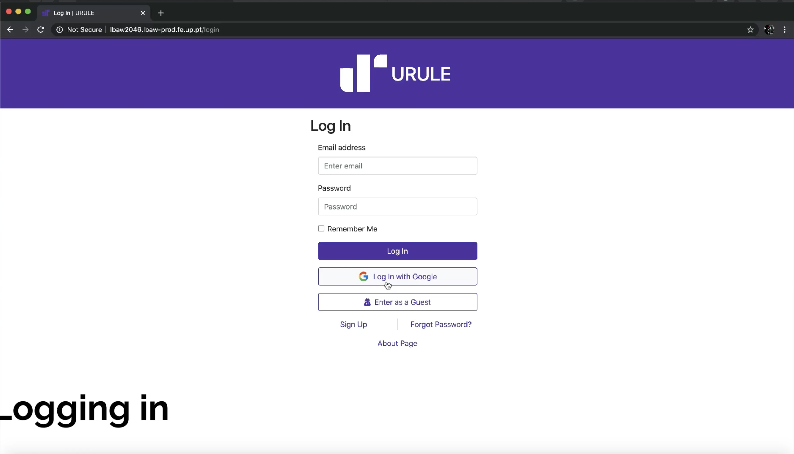

# A10: Presentation
## 1. Product presentation

Our product is a social network that allows users to create new relationships, making it easier to share moments with friends, and connecting people in a fun way.

We've implemented many features to facilitate this, such as post creation, rating and comments.
To create relationships we've added friend groups, direct messages and personalised profiles.
To find all this you can use our product's search feature!
Finally, to make sure our platforms rules are not broken we have a full moderator system regulated by our administrators.

URL to the product: http://lbaw2046.lbaw-prod.fe.up.pt  

## 2. Video presentation

Link to video: https://drive.google.com/drive/folders/1lP3xLPSfG1lMBwO-6l1zvV835ZVr_Fu5

## 3. Contacts

* Alexandre Carqueja, [up201705049@fe.up.pt](mailto:up201705049@fe.up.pt)
* Daniel Brandão, [up201705812@fe.up.pt](mailto:up201705812@fe.up.pt)
* Henrique Santos, [up201706898@fe.up.pt](mailto:up201706898@fe.up.pt) 
* Pedro Moás, [up201705208@fe.up.pt](mailto:up201705208@fe.up.pt)

# Annex A: Group Self-Evaluation

All group members have worked in all the components.

The individual contribution of each member to the LBAW project, and considering all artefacts, is expressed in the following list:

* Alexandre Carqueja, B
* Daniel Brandão, B
* Henrique Santos, B
* Pedro Moás, A

***
GROUP2046, 03/06/2020

* Alexandre Carqueja, [up201705049@fe.up.pt](mailto:up201705049@fe.up.pt) (Editor)
* Daniel Brandão, [up201705812@fe.up.pt](mailto:up201705812@fe.up.pt)
* Henrique Santos, [up201706898@fe.up.pt](mailto:up201706898@fe.up.pt) 
* Pedro Moás, [up201705208@fe.up.pt](mailto:up201705208@fe.up.pt)