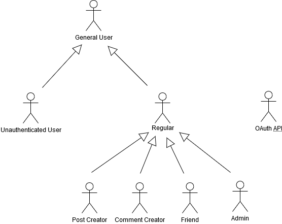

# A2: Actors and User stories

Our goal is to create a social network that allows users to create new relationships, making it easier to share moments with friends, and connecting people in a fun way.

This artifact specifies the actors and user stories for this project, as a way to document the project requirements.

## 1. Actors

| **Identifier** | **Description** | **Example** |
| --- | --- | --- |
| General User | Generic User that has access to public information. | n/a |
| Unauthenticated User | Unauthenticated User. Can register itself (sign-up) or sign-in in the system . | n/a |
| Regular | Authenticated User. Can check news feed, post and comment on private and public feed, add friends, edit profile, logout and delete account. | moas31 |
| Post Creator | Authenticated User. Can delete, edit, create comment rules and add images and links to his posts. | moas31 |
| Comment Creator | Authenticated User. Can delete and edit his posts. | moas31 |
| Friend | Authenticated User. Can read a friend's timeline, exchange messages, read message history with a friend and group their friends. | moas31 |
| Admin | Authenticated User. Can remove posts and comments from another users, ban other users and create announcements. | admin |
| OAuth API | External OAuth API that can be used to register or authenticate into the system. | Google |

## 2. User Stories

### 2.1. General User

| **Identifier** | **Name** | **Priority** | **Description** |
| --- | --- | --- | --- |
| G01 | Search Posts | High | As a General User, I want to search for posts by their date or keywords, so that I can find relevant content easily. |
| G02 | Search People | High | As a General User, I want to search for users by their name, so that I can easily find and connect with new people. |
| G03 | View Profiles | High | As a General User, I want to see a User's profile when I click on someone's avatar, so that I may get more details about who they are. |
| G04 | Check home page | High | As a General User, I want to check the website's home page, so that I can access all of the content it has to offer. |
| G05 | Check about page | High | As a General User, I want to check the website's about page, so that I can find out more about its goals and creators. |
| G06 | Check announcements | High | As a General User, I want to check the website's announcements, so that I can easily find out any important notices I should see. |

### 2.2 Unauthenticated User

| **Identifier** | **Name** | **Priority** | **Description** |
| --- | --- | --- | --- |
| UU01 | Signing up | High | As an Unauthenticated User, I want to register a new account, so that I can authenticate into the system. |
| UU02 | Signing in | High | As an Unauthenticated User, I want to authenticate into the system, so that I can access privileged functions. |
| UU03 | Signing up with Google | Low | As an Unauthenticated User, I want to register a new account with my Google account, so that I can authenticate into the system and have my accounts associated. |
| UU04 | Signing in with Google | Low | As an Unauthenticated User, I wish to log into the website using my associated google account, so that I don't need to keep separate accounts. |

### 2.3. Regular

| **Identifier** | **Name** | **Priority** | **Description** |
| --- | --- | --- | --- |
| R01 | Check news feed | High | As a Regular, I want to check recent posts created by my friends so that I can easily know what they have been up to. |
| R02 | Comment on posts | High | As a Regular, I want to leave comments on posts I find so that I can share my opinion with other people. |
| R03 | Create private posts | High | As a Regular, I want to post messages that only my friends can see so that I can have more control over my privacy. |
| R04 | Create public posts | High | As a Regular, I want to post messages that everyone can find so that I can share my opinions more publicly. |
| R05 | Appraise Posts and Comments | High | As a Regular, I want to be able to react to posts and comments so that other users can see which ones I liked/disliked. |
| R06 | Edit Profile | High | As a Regular, I want to edit my profile so that I can keep my information updated. |
| R07 | Delete Account | High | As a Regular, I want to delete my account, so that I can safely remove all my information from the website. |
| R08 | Logout | High | As a Regular, I want to log out of my account so that other people in the same computer don't have access to it. |
| R09 | Add Friends | High | As a Regular, I want to add other users as friends so that I can more easily see what they're up to. |
| R10 | Check Friend Requests | High | As a Regular, I want to see which Users want to befriend me, so that I can quickly connect with those people. |
| R11 | Respond to Friend Requests | High | As a Regular, I want to accept or reject an incoming friend request, so that I can have more control of who my friends are |
| R12 | Create Friend Group | Medium | As a Regular, I want to create a group for my friends, so that I can later add them into it. |
| R13 | Check notifications | Medium | As a Regular, I want to check my unseen notifications, so that I can find out what happened while I was not online. |
| R14 | Open notification | Medium | As a Regular, I want to open/clear a notification so that I can get rid of seen notifications. |
| R15 | Report post | Medium | As a Regular, I want to report a post I find inappropriate, so that the admins can know about my opinion. |

### 2.4 Post Creator

| **Identifier** | **Name** | **Priority** | **Description** |
| --- | --- | --- | --- |
| PC01 | Delete Post | Medium | As a Post Creator, I want to delete the post I created, so that I can have more control over my account. |
| PC02 | Create Comment Rules | Medium | As a Post Creator, I want to make a rule that  its comments have to follow, so that I can create a more dynamic interaction. |
| PC03 | Edit Post | Low | As a Post Creator, I want to edit the post I created, so that I may correct any prior mistake. |
| PC04 | Add images and links to posts | Low | As a Post Creator, I want to add images and links to my posts, so that they may be more illustrative and interactive. |

### 2.5 Comment Creator

| **Identifier** | **Name** | **Priority** | **Description** |
| --- | --- | --- | --- |
| CC01 | Delete Comment | Medium | As a Comment Creator, I want to delete the comment I created, so that I may have more control over my public information. |
| CC02 | Edit Comment | Low | As a Comment Creator, I want to edit the post I created, so that I may correct any prior mistakes. |

### 2.6  Friend

| **Identifier** | **Name** | **Priority** | **Description** |
| --- | --- | --- | --- |
| F01 | Read Friend Timeline | High | As a Friend of a User, I want to check their recent posts so that I can easily check what's recently happened in their life. |
| F02 | Read Message History | Medium | As Friend of a User, I want to read past messages I exchanged with that user, so that I can easily remember the context of previous conversations. |
| F03 | Exchange Messages | Medium | As Friend of a User, I want to send and receive messages from them, so that I can easily communicate with that specific person. |
| F04 | Add Friend to Group | Medium | As a Friend of a User, I want to add them into one of my groups, so that I can keep my social circles organized. |

### 2.7. Admin

| **Identifier** | **Name** | **Priority** | **Description** |
| --- | --- | --- | --- |
| A01 | Remove Posts | High | As an admin, I want to be able to remove posts so that I can make sure everything is in line with the terms of usage. |
| A02 | Remove Comments | High | As an admin, I want to remove comments that don't fall in line with the terms of usage, so that I can keep our platform safe. |
| A03 | Ban users | High | As an admin, I want to ban users that have breached our terms of usage several times, so that I can reduce bad behaviour on our platform. |
| A04 | Check post reports | High | As an admin, I want to check the most reported posts, so that I can easily remove inappropriate content from the social network. |
| A05 | Create Announcements | Low | As an admin, I want to create pinned posts that stay at the top of each user's feed, so that I'm sure that important information reaches everyone. |

## A1. Annex: Supplementary requirements

### A1.1. Business rules

| **Identifier** | **Name** | **Description** |
| --- | --- | --- |
| BR01 | Single Post/Comment Appraisal | A user may only appraise a post or comment once, with one of two possible reactions (like or dislike). |
| BR02 | Private Posts | A user may only see another user's private posts if he is friends with said user. |
| BR03 | Deleted User | Once a user deletes his profile, his comments/posts/appraisals are labeled as authored by "deleted user". |
| BR04 | Comment dates must come after Post dates | The date of a comment has to be posterior to the date on its post. |
| BR05 | Can't self Friend | A User can't add himself as a Friend |
| BR06 | Can't self add to Group | A User can't add himself to a Group |

### A1.2. Technical requirements

| **Identifier** | **Name** | **Description** |
| --- | --- | --- |
| TR01 | **Usability** | The user interface should be intuitive and not too elaborate, so that it doesn't overwhelm the user. |
| TR02 | **Security** | There should be a robust security system in effect that protects individual's data from unauthenticated peers and only allow access to those authorized. |
| TR03 | **Scalability** | The system should be prepared to deal with an exponentially increasing number of users. |
| TR04 | Availability | The system must be available 99 percent of the time in each 24-hour period |
| TR05 | Accessibility | The system must ensure that everyone can access the pages, regardless of whether they have any handicap or not, or the Web browser they use. |
| TR06 | Performance | The system should have response times shorter than 2s to ensure the user's attention. |
| TR07 | Web application | The system should be implemented as a Web application with dynamic pages (HTML5, JavaScript, CSS3 and PHP). |
| TR08 | Portability | The server-side system should work across multiple platforms (Linux, Mac OS, etc.) |
| TR09 | Database | The PostgreSQL 9.4 database management system must be used. |
| TR10 | Robustness | The system must be prepared to handle and continue operating when runtime errors occur. |
| TR11 | Ethics | The system must respect the ethical principles in software development (for example, the password must be stored encrypted to ensure that only the owner knows it). |

In our opinion, the 3 most important technical requirements for our work are usability (so our users feel comfortable and at ease with the UI we provide), data security and scalability (seen as a social network is often a rapidly growing website).

### A1.3. Restrictions

| **Identifier** | **Name** | **Description** |
| --- | --- | --- |
| C01 | Deadline | The system should be ready to deploy at the end of the semester |

## Revision history

27/02/2020 - First Submission: Created Artifact 2  
28/02/2020 - Revision 1: Ordered user story sections according to hierarchy, split Group Friends story into "Create Friend Group" and "Add Friend to Group". Added User Stories: "Check home page", "Check about page", "Check friend requests". Clarified some other stories. Clarified some business rules. Fixed punctuation all-around.  
22/03/2020 - Revision 2: Final tweaks for ER submission - Added BR05 and BR06.
19/04/2020 - Revision 3: Added G06, R11.
25/04/2020 - Revision 4: Added A04, R13, R14, R15.

***
GROUP2046, 27/02/2020

* Alexandre Carqueja, [up201705049@fe.up.pt](mailto:up201705049@fe.up.pt) 
* Daniel Brandão, [up201705812@fe.up.pt](mailto:up201705812@fe.up.pt)
* Henrique Santos, [up201706898@fe.up.pt](mailto:up201706898@fe.up.pt) (Editor)
* Pedro Moás, [up201705208@fe.up.pt](mailto:up201705208@fe.up.pt)

