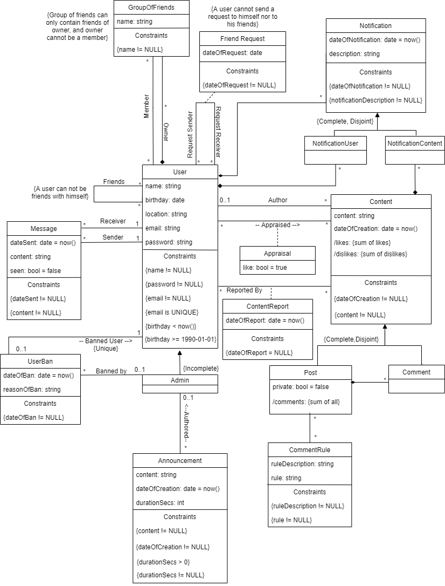

# A4: Conceptual Data Model

Our product is a social network that allows users to create new relationships, making it easier to share moments with friends, and connecting people in a fun way.

This artefact specifies the UML diagram for our database, which will serve as a guide when coding the actual database for our website

## 1. Class diagram

## 2. Additional Business Rules

| **Identifier** | **Name** | **Description** |
| --- | --- | --- |
| BR07 | Deleted User keeps Content | In UML the 0-1 association to the User mean that if the user is deleted, the Content is kept, but displayed as "Created by deleted user"  |

## Revision history

* 19/03/2020 - First Submission: Created Artifact 4
* 20/03/2020 - Revision 1: Added Moderation to UML and Notifications
* 25/03/2020 - Revision 2: Small tweaks in order to keep the conceptual model in line with the relational model
* 26/03/2020 - Revision 3: Added Notification types.

---

GROUP2046, 19/03/2020

* Alexandre Carqueja, [up201705049@fe.up.pt](mailto:up201705049@fe.up.pt) (Editor)
* Daniel Brandão, [up201705812@fe.up.pt](mailto:up201705812@fe.up.pt)
* Henrique Santos, [up201706898@fe.up.pt](mailto:up201706898@fe.up.pt)
* Pedro Moás, [up201705208@fe.up.pt](mailto:up201705208@fe.up.pt)