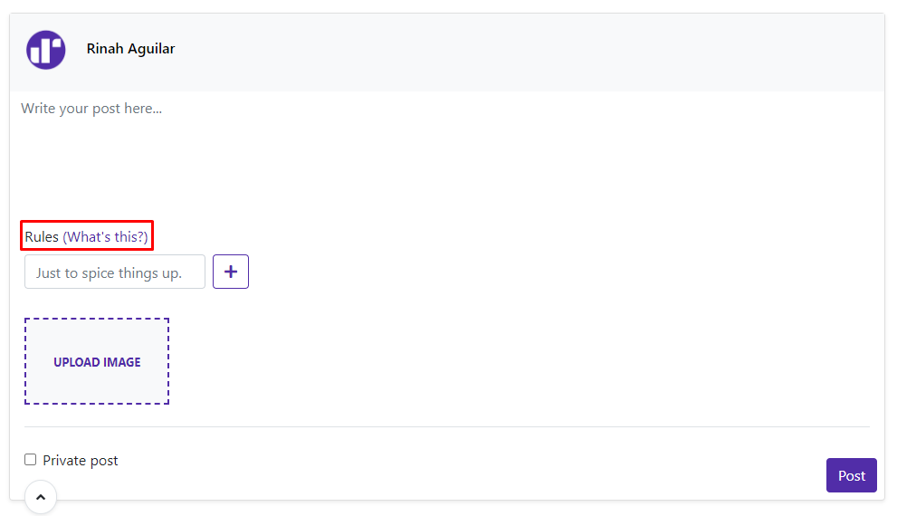

# A9: Product

Our product is a social network that allows users to create new relationships, making it easier to share moments with friends, and connecting people in a fun way.

This artefact is the result of the implementation of the information system designed in the earlier stages, using PHP and the Laravel Framework for producing dynamic web pages, and PostgreSQL as a database management system.

## 1. Installation

Source Code: https://git.fe.up.pt/lbaw/lbaw1920/lbaw2046

In order to run, all that is necessary is the command:
```shell
docker run -it -p 8000:80 -e DB_DATABASE="lbaw2046" -e DB_USERNAME="lbaw2046" -e DB_PASSWORD="EC382167" lbaw2046/lbaw2046
```


## 2. Usage

URL: http://lbaw2046.lbaw-prod.fe.up.pt/

### 2.1. Administration Credentials

Administration URL: http://lbaw2046.lbaw-prod.fe.up.pt/admin 

| Username | Password |
| -------- | -------- |
| nec.metus.facilisis@nunc.ca    | 1234 |

### 2.2. User Credentials

| Type          | Username  | Password |
| ------------- | --------- | -------- |
| basic account | mi.lacinia@suscipit.net    | 1234 |

## 3. Application Help
In every page, users can easily access the about page in the side menu, where they can learn about our concept as well as the development team.
In order to introduce to our users the concept of rules, a help section was implemented in the post form, where a user can click and have a popup explain several aspects about rules.

  
Fig 1. Post form with rules help link

  
Fig 2. Complete guide to rules

Furthermore, we strived for clean and intuitive navigation by keeping the navigation bar constant throughout the website, making it so the user doesn't need to learn how to access specific pages in each of the website's subpages.

We also made an effort so that whenever a user clicks on an element, the page is redirected to the relevant page, be it a post or a profile.

We also have helpful error messages for users whenever a bad input is detected, such as green/red text messages whenever an action is requested by the user, examples for which can be seen in the input validation section.

## 4. Input Validation
We implemented input validation for client side using javascript and server side by using laravel validation facilities. 

#### Example of client side validation (edit post)
```javascript
if (!validateInputLength(getFormInput(this, 'content'), "Post", 1, CONTENT_MAXLEN))
    return
```
Several helper function were created to make input validation more consistent and streamlined on javascript.
```javascript
function validateInputLength(input, type, minLength, maxLength, setSuccess) {
    let length = input.value.length;
    if (length < minLength) {
        let missing = minLength - length;
        if (minLength === 1)
            setInputError(input, `${type} cannot be empty!`)
        else setInputError(input, `${type} is too small, try adding about ${missing} character${missing===1?'':'s'} to it.`)
        return false;
    }
    else if (length > maxLength) {
        let overflow = length - maxLength;
        setInputError(input, `${type} is too large, try shrinking it by about ${overflow} character${overflow===1?'':'s'}.`)
        return false;
    }
    else {
        if (setSuccess)
            setInputSuccess(input, '');
        return true;
    }
}
```
#### Example of server side validation (create post)
```php
        $request->validate([
            'content' => 'required|max:' . Content::MAX_LENGTH,
            'private-post' => 'required|boolean',
            'image' => 'mimes:jpeg,jpg,png,gif|max:10000'
        ]);
```

## 5. Check Accessibility and Usability
### Accessibility
In the accessbility section we were only missing two aspects: the readability without CSS and submissions without Javascript.
This is mostly due to our website supporting a lot of AJAX and bootsrap features to improve the user experience.
### Usability
In the usability section we were not missinig any of the required features!

Here are the results of the accessibility and usability checklists in pdf form: https://git.fe.up.pt/lbaw/lbaw1920/lbaw2046/-/blob/master/usabilityReport.zip

## 6. HTML & CSS Validation
During HTML validation, we found that the only real validation issues were the date input format not being valid for all browsers (which we disregarded, seen as all current popular browsers support it) and code generated by bootstrap, which we have no control over.

As far as CSS validation goes, most files detect using vars as an error, but that is because we did not include the bootstrap definition of those color vars. Seen as these are the only css "errors" we detected, we consider our css to be valid.

Here are the results of validation in pdf form: https://git.fe.up.pt/lbaw/lbaw1920/lbaw2046/-/blob/master/validation.rar

## 7. Revisions to the Project

### A2 Revisions
* 25/04/2020 - Revision 4: Added A04 (Check post reports), R13 (Check Notification), R14 (Open Notification), R15 (Report Post).

### A7 Revisions
* 23/04/2020 - Revision 2: Added clear reports resource. Added admin home page resource.
* 26/04/2020 - Revision 3: Added extra password recovery resources.
* 10/05/2020 - Revision 4: Removed parameters from profile management resources, updated permissions.
* 10/05/2020 - Revision 5: Added hot page (public page with most popular recent posts).
* 11/05/2020 - Revision 6: Added 403 page.
* 03/06/2020 - Revision 7: Added "seen" API and removed notifications page.

### General Revisions
* None so far

## 8. Implementation Details

### 8.1. Libraries Used

| Name | URL | Description of use | Example |
| ---- | --- | ------------------ | ------- |
| Intervention Image | http://image.intervention.io/ | Manipulating image uploads, such as in posts and user profile. Also used to reduce image quality if needed. | http://lbaw2046.lbaw-prod.fe.up.pt/users/11-DennisHartman |
| Laravel Carbon | https://carbon.nesbot.com/docs/ | Manipulating and formatting dates, such as showing post dates, or remaining announcement  time. | http://lbaw2046.lbaw-prod.fe.up.pt/feed |
| Socialite | https://laravel.com/docs/socialite | Signing In/Up with Google Account. | http://lbaw2046.lbaw-prod.fe.up.pt/redirect |
| Font Awesome | https://fontawesome.com/ | Displaying icons, throughout the website. | http://lbaw2046.lbaw-prod.fe.up.pt/feed |
| WebSockets | https://docs.beyondco.de/laravel-websockets/ | For the chat functionality. Transmitting received messages and setting them as seen. | http://lbaw2046.lbaw-prod.fe.up.pt/messages |
| Gmail | N/A | For sending emails on the password reset functionality. | http://lbaw2046.lbaw-prod.fe.up.pt/password/reset |

### 8.2 User Stories

| US Identifier | Name    | Priority                       | Team members               | State  |
| ------------- | ------- | ------------------------------ | -------------------------- | ------ |
| G01 | Search Posts | Mandatory | Alexandre Carqueja | 100% |
| G02 | Search People | Mandatory | Alexandre Carqueja | 100% |
| G03 | View Profiles | Mandatory | Alexandre Carqueja, Daniel Brandão, Henrique Santos, Pedro Moás | 100% |
| G04 | Check home page | Mandatory | Alexandre Carqueja, Daniel Brandão, Henrique Santos, Pedro Moás | 100% |
| G05 | Check about page | Mandatory | Pedro Moás | 100% |
| G06 | Check announcements | Important | Pedro Moás | 100% |
| UU01 | Signing Up | Mandatory | Pedro Moás | 100% |
| UU02 | Signing in | Mandatory | Pedro Moás | 100% |
| UU03 | Signing up with Google | Optional | Daniel Brandão  | 100% |
| UU04 | Signing in with Google | Optional | Daniel Brandão  | 100% |
| R01  | Check news feed | Mandatory | Alexandre Carqueja, Daniel Brandão, Henrique Santos, Pedro Moás | 100% |
| R02 | Comment on posts | Mandatory | Henrique Santos | 100% |
| R03 | Create private posts | Mandatory | Pedro Moás | 100% |
| R04 | Create public posts | Mandatory | Pedro Moás | 100% |
| R05 | Appraise Posts and Comments | Important | Henrique Santos | 100% |
| R06 | Edit Profile | Mandatory | Pedro Moás | 100% |
| R07 | Delete Account | Mandatory | Pedro Moás | 100% |
| R08 | Logout | Mandatory | Pedro Moás | 100% |
| R09 | Add Friends | Mandatory | Pedro Moás | 100% |
| R10 | Check Friend Requests | Mandatory | Henrique Santos | 100% |
| R11 | Respond to Friend Requests | Mandatory | Henrique Santos | 100% |
| R12 | Create Friend Group | Mandatory | Pedro Moás | 100% |
| R13 | Check notifications | Mandatory |  Alexandre Carqueja | 100% |
| R14 | Open notification | Mandatory | Alexandre Carqueja | 100% |
| R15 | Report post | Mandatory |  Pedro Moás | 100% |
| PC01 | Delete Post | Important | Pedro Moás | 100% |
| PC02 | Create Comment Rules | Important |  Pedro Moás | 100% |
| PC03 | Edit Post | Important | Pedro Moás | 100% |
| PC04 | Add images and links to posts | Important | Pedro Moás | 100% |
| CC01 | Delete Comment | Important | Henrique Santos, Pedro Moás | 100% |
| CC02 | Edit Comment | Important | Henrique Santos, Pedro Moás | 100% |
| F01 | Read Friend Timeline | Mandatory | Alexandre Carqueja, Daniel Brandão, Henrique Santos, Pedro Moás | 100% |
| F02 | Read Message History | Mandatory | Henrique Santos | 100% |
| F03 | Exchange Messages | Mandatory | Henrique Santos | 100% |
| F04 | Add Friend to Group | Mandatory | Pedro Moás | 100% |
| A01 | Remove Posts | Important | Daniel Brandão | 100% |
| A02 | Remove Comments | Important | Daniel Brandão | 100% |
| A03 | Ban/Unban users | Mandatory | Daniel Brandão | 100% |
| A04 | Check post reports | Important | Daniel Brandão | 100% |
| A05 | Create Announcements | Important | Daniel Brandão | 100% |

## Revision history

03/06/2020 - First Submission: Created Artifact 9

***
GROUP2046, 03/06/2020

* Alexandre Carqueja, [up201705049@fe.up.pt](mailto:up201705049@fe.up.pt) 
* Daniel Brandão, [up201705812@fe.up.pt](mailto:up201705812@fe.up.pt)
* Henrique Santos, [up201706898@fe.up.pt](mailto:up201706898@fe.up.pt) 
* Pedro Moás, [up201705208@fe.up.pt](mailto:up201705208@fe.up.pt) (Editor)
